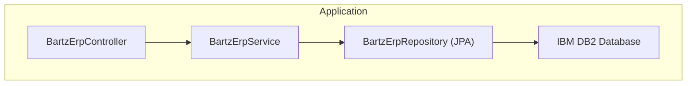
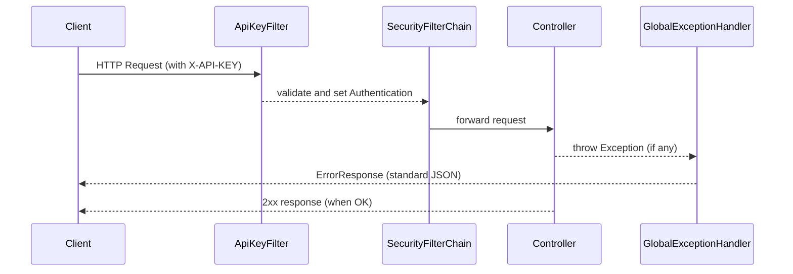

# 🚀 API Bartz Móveis - ERP

Uma API REST robusta e segura desenvolvida em **Spring Boot** para consultas de dados em banco de dados **IBM DB2**, com foco em performance, segurança e boas práticas de engenharia de software.

---

## 📋 Índice

- [Visão Geral](#visão-geral)
- [Arquitetura](#arquitetura)
- [Tecnologias](#-tecnologias)
- [Segurança](#-segurança-api-key)
- [Tratamento de Erros](#-tratamento-de-erros)
- [Endpoints](#-endpoints)
- [Configuração](#-configuração)
- [Como Executar](#-como-executar)
- [Exemplos de Uso](#-exemplos-de-uso)
- [Conceitos Aplicados](#-conceitos-aplicados)
- [Estrutura do Projeto](#-estrutura-do-projeto)

---

## 🎯 Visão Geral

Esta API fornece uma interface segura e eficiente para consultas de itens e produtos no banco de dados IBM DB2 da Bartz Móveis. O projeto implementa padrões empresariais como **autenticação via API Key**, **tratamento global de exceções**, **configuração via variáveis de ambiente** e **documentação automática com Swagger**.

**Principais características:**
- ✅ Autenticação por API Key (header `X-API-KEY`)
- ✅ Configuração segura via variáveis de ambiente
- ✅ Tratamento centralizado de exceções
- ✅ Documentação interativa com Swagger/OpenAPI
- ✅ Validação de requisições
- ✅ Suporte a paginação
- ✅ CORS configurado para múltiplas origens
- ✅ Logging estruturado

---

## 🏗️ Arquitetura

### Padrão MVC + Service Layer



### Camadas de Segurança (fluxo de requisição)



---

## 🛠️ Tecnologias

| Categoria | Tecnologia | Versão | Propósito |
|-----------|-----------|--------|----------|
| **Runtime** | Java | 21 LTS | Linguagem principal |
| **Framework** | Spring Boot | 4.0.2 | Framework web |
| **ORM** | Spring Data JPA / Hibernate | 6.4.x | Mapeamento relacional |
| **Segurança** | Spring Security | 6.2.x | Autenticação e autorização |
| **Banco de Dados** | IBM DB2 | 12.1.3.0 | Database corporativa |
| **Documentação** | SpringDoc OpenAPI 2.0 | 2.x | Swagger UI |
| **Build** | Maven | 3.9+ | Gerenciamento de dependências |
| **Logs** | SLF4J + Logback | - | Logging estruturado |
| **Produtividade** | Lombok | 1.18.x | Reduz boilerplate |

---

## 🔐 Segurança: API Key

### Modelo de Autenticação

A API utiliza **autenticação stateless** baseada em API Key. O cliente deve incluir uma chave secreta em cada requisição via header HTTP.

### Fluxo de Autenticação

```
1. Cliente recebe: API_KEY = "suaapikey"

2. A cada requisição, envia:
   GET /api/erp
   Header: X-API-KEY: suaapikey

3. ApiKeyFilter valida:
   ✓ Header existe?
   ✓ Valor é igual ao esperado?

4. Se ✓, cria Authentication e deixa passar
   Se ✗, retorna 401 Unauthorized
```

### Implementação: ApiKeyProperties.java

```java
@Component
public class ApiKeyProperties {
    @Value("${api.key}")
    private String key;
    
    public String getKey() {
        return key;
    }
}
```

### Implementação: ApiKeyFilter.java

```java
public class ApiKeyFilter extends OncePerRequestFilter {
    private final String expectedKey;
    
    public ApiKeyFilter(String expectedKey) {
        this.expectedKey = expectedKey;
    }
    
    @Override
    protected void doFilterInternal(HttpServletRequest req, 
                                    HttpServletResponse res,
                                    FilterChain chain) 
            throws ServletException, IOException {
        
        String key = req.getHeader("X-API-KEY");
        
        if (key == null || !key.equals(expectedKey)) {
            res.setStatus(HttpServletResponse.SC_UNAUTHORIZED);
            res.getWriter().write("API key inválida");
            return;
        }
        
        // Cria Authentication válido
        var auth = new UsernamePasswordAuthenticationToken(
            "api-client", null, Collections.emptyList());
        SecurityContextHolder.getContext().setAuthentication(auth);
        
        chain.doFilter(req, res);
    }
}
```

### Implementação: SecurityConfig.java

```java
@Configuration
public class SecurityConfig {
    
    @Autowired
    private ApiKeyProperties apiKeyProperties;
    
    @Bean
    public ApiKeyFilter apiKeyFilter() {
        return new ApiKeyFilter(apiKeyProperties.getKey());
    }
    
    @Bean
    public SecurityFilterChain filterChain(HttpSecurity http) throws Exception {
        
        http.csrf(csrf -> csrf.disable())
            .sessionManagement(session -> 
                session.sessionCreationPolicy(SessionCreationPolicy.STATELESS))
            .authorizeHttpRequests(auth -> auth.anyRequest().authenticated())
            .addFilterBefore(apiKeyFilter(), 
                UsernamePasswordAuthenticationFilter.class);
        
        return http.build();
    }
}
```

---

## 📡 Endpoints

### Base URL
```
http://localhost:8081/api/erp
```

### Endpoints Disponíveis

| Método | Endpoint | Descrição | Query Params | Headers |
|--------|----------|-----------|--------------|---------|
| **GET** | `/api/erp` | Lista todos os itens (paginado) | `page`, `size`, `sort` | `X-API-KEY` |
| **GET** | `/api/erp/find-by-code` | Busca por código exato | `q` (obrigatório) | `X-API-KEY` |
| **GET** | `/api/erp/find-by-description` | Busca por descrição exata | `q` (obrigatório) | `X-API-KEY` |
| **GET** | `/api/erp/search-code` | Busca parcial por código | `q` (obrigatório) | `X-API-KEY` |
| **GET** | `/api/erp/search-desc` | Busca parcial por descrição | `q` (obrigatório) | `X-API-KEY` |

---

## ⚙️ Configuração

### Variáveis de Ambiente Obrigatórias

| Variável | Descrição | Exemplo |
|----------|-----------|---------|
| `API_KEY` | Chave de autenticação da API | `suaapikey` |
| `DB_URL` | URL de conexão com DB2 | `jdbc:db2://localhost:50000/nomedobanco` |
| `DB_USERNAME` | Usuário do banco | `admin` |
| `DB_PASSWORD` | Senha do banco | `senha123` |

### application.properties

```properties
# Server
server.port=8081

# Database
spring.datasource.url=${DB_URL}
spring.datasource.username=${DB_USERNAME}
spring.datasource.password=${DB_PASSWORD}
spring.datasource.driver-class-name=com.ibm.db2.jcc.DB2Driver

# JPA/Hibernate
spring.jpa.hibernate.ddl-auto=validate
spring.jpa.show-sql=false
spring.jpa.properties.hibernate.dialect=org.hibernate.dialect.DB2Dialect

# Logging
logging.level.root=INFO
logging.level.bartzmoveis.apigetitem=DEBUG

# Security
api.key=${API_KEY}

# Swagger
springdoc.api-docs.path=/v3/api-docs
springdoc.swagger-ui.path=/swagger-ui.html
```

---

## 🚀 Como Executar

### Pré-requisitos

- **Java 21 LTS** ou superior
- **Maven 3.9+**
- **IBM DB2** configurado e acessível
- **Variáveis de ambiente** definidas

### Instalação e Setup

#### 1. Clone e Navegue

```bash
git clone <url-do-repositorio>
cd apigetitem
```

#### 2. Configure as Variáveis de Ambiente

**No Windows (PowerShell):**
```powershell
$env:API_KEY="suaapikey"
$env:DB_URL="jdbc:db2://localhost:50000/nomedobanco"
$env:DB_USERNAME="admin"
$env:DB_PASSWORD="senha123"
```

**Ou via `.env` (desenvolvimento local):**
```dotenv
API_KEY=suaapikey
DB_URL=jdbc:db2://localhost:50000/nomedobanco
DB_USERNAME=admin
DB_PASSWORD=senha123
```

Adicione este arquivo ao `.gitignore`:
```gitignore
.env
*.secret
```

#### 3. Execute a Aplicação

```bash
# Com Maven
./mvnw spring-boot:run

# Ou (Windows)
mvnw.cmd spring-boot:run

# Ou via JAR
mvn clean package
java -jar target/apigetitem-1.0.0.jar
```

#### 4. Verifique se Está Rodando

```bash
curl -H "X-API-KEY: suaapikey" http://localhost:8081/api/erp
```

---

## 📚 Exemplos de Uso

### 1. Listar Todos os Itens (Paginado)

```bash
curl -H "X-API-KEY: suaapikey" \
  "http://localhost:8081/api/erp?page=0&size=10&sort=codeItem,asc"
```

**Resposta:**
```json
{
  "content": [
    {
      "id": 1,
      "codeItem": "10.01",
      "description": "Armário 2 portas",
      "refComercial": "ARM-2P"
    }
  ],
  "pageable": {
    "pageNumber": 0,
    "pageSize": 10,
    "totalElements": 1000
  }
}
```

### 2. Buscar por Código Exato

```bash
curl -H "X-API-KEY: suaapikey" \
  "http://localhost:8081/api/erp/find-by-code?q=10.01"
```

### 3. Buscar Parcial por Descrição

```bash
curl -H "X-API-KEY: suaapikey" \
  "http://localhost:8081/api/erp/search-desc?q=armario"
```

### 4. Requisição Sem API Key (Erro)

```bash
curl "http://localhost:8081/api/erp"
```

**Resposta (401):**
```json
{
  "status": 401,
  "message": "API key inválida",
  "timestamp": "2026-02-24T10:30:00"
}
```

---

## 📖 Conceitos Aplicados

### 1. **Spring Boot & Spring Framework**
- ✅ Dependency Injection via `@Autowired`, `@Component`, `@Bean`
- ✅ Anotações `@RestController`, `@Service`, `@Repository`
- ✅ Composição de beans e lifecycle management

### 2. **Spring Security**
- ✅ Custom `OncePerRequestFilter` para autenticação
- ✅ `SecurityFilterChain` para configuração global
- ✅ `SecurityContextHolder` para armazenar contexto autenticado
- ✅ Stateless authentication (sem sessões)

### 3. **Spring Data JPA**
- ✅ Repositories automatizados
- ✅ Query methods customizados
- ✅ Paginação com `Pageable`
- ✅ ORM com Hibernate

### 4. **Tratamento de Erros**
- ✅ `@ControllerAdvice` para handler global
- ✅ `@ExceptionHandler` para tipos específicos
- ✅ Exceções customizadas (RuntimeException)
- ✅ Respostas padronizadas com DTO

### 5. **Configuração e Variáveis de Ambiente**
- ✅ `@Value` para injeção de propriedades
- ✅ `@ConfigurationProperties` para classes de config
- ✅ Placeholder substitution `${...}`
- ✅ Separação dev/prod via variáveis

### 6. **Boas Práticas**
- ✅ Padrão MVC (Model-View-Controller)
- ✅ Separação de responsabilidades (Controller/Service/Repository)
- ✅ DTOs para encapsulamento de dados
- ✅ Validação em camadas
- ✅ Logging estruturado
- ✅ CORS configurado
- ✅ Versionamento semântico

### 7. **Documentação**
- ✅ Swagger/OpenAPI com SpringDoc
- ✅ Auto-documentação de endpoints
- ✅ Exemplos de requisição/resposta

---

## 📁 Estrutura do Projeto

```
apigetitem/
├── src/
│   └── main/
│       ├── java/bartzmoveis/apigetitem/
│       │   ├── config/
│       │   │   ├── SecurityConfig.java
│       │   │   └── ApiKeyProperties.java
│       │   ├── controller/
│       │   │   └── BartzErpController.java
│       │   ├── service/
│       │   │   └── BartzErpService.java
│       │   ├── repository/
│       │   │   └── BartzErpRepository.java
│       │   ├── model/
│       │   │   └── BartzErpDB.java
│       │   ├── dto/
│       │   │   └── ErrorResponse.java
│       │   ├── security/
│       │   │   └── ApiKeyFilter.java
│       │   └── ApigetitemApplication.java
│       └── resources/
│           └── application.properties
├── pom.xml
├── .env
├── .gitignore
└── README.md
```

---

## 🔗 Documentação Interativa

- **Swagger UI:** [http://localhost:8081/swagger-ui.html](http://localhost:8081/swagger-ui.html)
- **OpenAPI JSON:** [http://localhost:8081/v3/api-docs](http://localhost:8081/v3/api-docs)

---

## 📄 Estrutura de Dados

A API mapeia a tabela `ITEM` com os seguintes atributos principais:
- `codeItem`: Código único do item.
- `description`: Descrição detalhada do produto.
- `refComercial`: Referência comercial do item.

---

## 👨‍💻 Autor

**Ralf** – Desenvolvedor Full Stack | Java | Spring Boot

---

## 📄 Licença

Este projeto é proprietário da **Bartz Móveis**.

