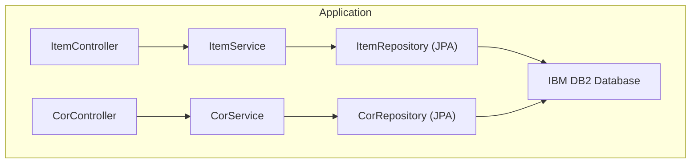
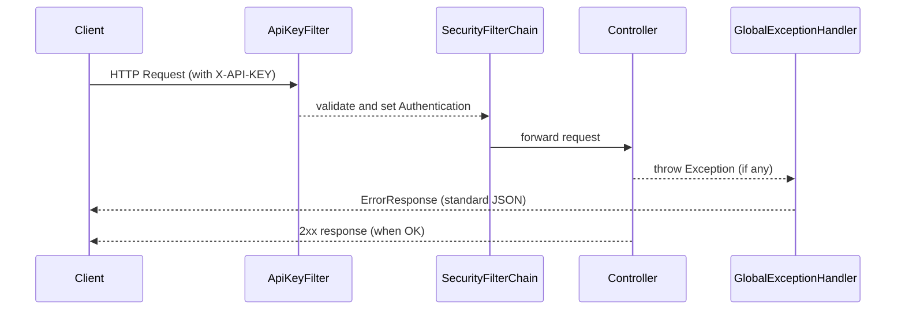

# 🚀 API Bartz Móveis - ERP

Uma API REST robusta e segura desenvolvida em **Spring Boot** para consultas de dados em banco de dados **IBM DB2**, com foco em performance, segurança e boas práticas de engenharia de software.

---

## 📋 Índice

- [Visão Geral](#visão-geral)
- [Arquitetura](#arquitetura)
- [Tecnologias](#-tecnologias)
- [Segurança](#-segurança-api-key)
- [Tratamento de Erros](#-tratamento-de-erros)
- [Endpoints](#-endpoints)
- [Configuração](#-configuração)
- [Como Executar](#-como-executar)
- [Exemplos de Uso](#-exemplos-de-uso)
- [Conceitos Aplicados](#-conceitos-aplicados)
- [Estrutura do Projeto](#-estrutura-do-projeto)

---

## 🎯 Objetivo e Problema Resolvido

**O Problema**: A Bartz Móveis possui um sistema ERP legado ancorado em um banco de dados IBM DB2. O acesso direto a essa base de dados dificulta a integração com novos front-ends, relatórios modernos ou aplicações de parceiros, além de expor as credenciais do banco de dados na rede se não houver um middleware apropriado.

**A Solução**: Esta API REST foi concebida para atuar como uma **Camada Anticorrupção (Ponte)**. Ela encapsula todo o acesso nativo e restrito do IBM DB2 entregando, em troca, serviços RESTful modernos e padronizados no formato JSON, de forma rápida, eficiente e altamente flexível (paginação, filtros).

**Principais características e ganhos:**
- ✅ **Segurança Apurada**: Autenticação por API Key (header `X-API-KEY`) em vez de dados acoplados do banco de dados.
- ✅ **Clean Code & Boas Práticas**: Validação de requisições, tratamento centralizado de exceções (GlobalExceptionHandler) e configuração via variáveis de ambiente.
- ✅ **Developer Experience (DX)**: Documentação interativa embarcada com Swagger/OpenAPI v3.
- ✅ **Alta Performance**: Paginação nativa e queries otimizadas pelo Spring Data.
- ✅ **Pronto para Nuvem (Cloud-Ready)**: Aplicação configurada para contêinerização (Docker) e com CI/CD estruturado.

---

## 🏗️ Arquitetura

### Padrão MVC + Service Layer


```mermaid
flowchart TB
  subgraph Application
    A1["ItemController"] --> B1["ItemService"]
    A2["CorController"] --> B2["CorService"]
    B1 --> C1["ItemRepository (JPA)"]
    B2 --> C2["CorRepository (JPA)"]
    C1 --> D["IBM DB2 Database"]
    C2 --> D
  end
```

### Camadas de Segurança (fluxo de requisição)


```mermaid
sequenceDiagram
  participant Client
  participant Filter as ApiKeyFilter
  participant Security as SecurityFilterChain
  participant Controller
  participant Handler as GlobalExceptionHandler

  Client->>Filter: HTTP Request (with X-API-KEY)
  Filter-->>Security: validate and set Authentication
  Security->>Controller: forward request
  Controller-->>Handler: throw Exception (if any)
  Handler-->>Client: ErrorResponse (standard JSON)
  Controller-->>Client: 2xx response (when OK)
```

---

## 🛠️ Tecnologias

| Categoria | Tecnologia | Versão | Propósito |
|-----------|-----------|--------|----------|
| **Runtime** | Java | 17 LTS | Linguagem principal |
| **Framework** | Spring Boot | 3.4.2 | Framework web |
| **ORM** | Spring Data JPA / Hibernate | 6.4.x | Mapeamento relacional |
| **Segurança** | Spring Security | 6.2.x | Autenticação e autorização |
| **Banco de Dados** | IBM DB2 | 12.1.3.0 | Database corporativa |
| **Documentação** | SpringDoc OpenAPI 2.0 | 2.x | Swagger UI |
| **Build** | Maven | 3.9+ | Gerenciamento de dependências |
| **Logs** | SLF4J + Logback | - | Logging estruturado |
| **Produtividade** | Lombok | 1.18.x | Reduz boilerplate |

---

## 🔐 Segurança: API Key

### Modelo de Autenticação

A API utiliza **autenticação stateless** baseada em API Key. O cliente deve incluir uma chave secreta em cada requisição via header HTTP.

### Fluxo de Autenticação

```
1. Cliente recebe: API_KEY = "suaapikey"

2. A cada requisição, envia (exemplo):
   GET /api/item
   Header: X-API-KEY: suaapikey

3. ApiKeyFilter valida:
   ✓ Header existe?
   ✓ Valor é igual ao esperado?

4. Se ✓, cria Authentication e deixa passar
   Se ✗, retorna 401 Unauthorized
```

### Implementação: ApiKeyProperties.java

```java
@Component
public class ApiKeyProperties {
    @Value("${api.key}")
    private String key;
    
    public String getKey() {
        return key;
    }
}
```

### Implementação: ApiKeyFilter.java

```java
public class ApiKeyFilter extends OncePerRequestFilter {
    private final String expectedKey;
    
    public ApiKeyFilter(String expectedKey) {
        this.expectedKey = expectedKey;
    }
    
    @Override
    protected void doFilterInternal(HttpServletRequest req, 
                                    HttpServletResponse res,
                                    FilterChain chain) 
            throws ServletException, IOException {
        
        String key = req.getHeader("X-API-KEY");
        
        if (key == null || !key.equals(expectedKey)) {
            res.setStatus(HttpServletResponse.SC_UNAUTHORIZED);
            res.getWriter().write("API key inválida");
            return;
        }
        
        // Cria Authentication válido
        var auth = new UsernamePasswordAuthenticationToken(
            "api-client", null, Collections.emptyList());
        SecurityContextHolder.getContext().setAuthentication(auth);
        
        chain.doFilter(req, res);
    }
}
```

### Implementação: SecurityConfig.java

```java
@Configuration
public class SecurityConfig {
    
    @Autowired
    private ApiKeyProperties apiKeyProperties;
    
    @Bean
    public ApiKeyFilter apiKeyFilter() {
        return new ApiKeyFilter(apiKeyProperties.getKey());
    }
    
    @Bean
    public SecurityFilterChain filterChain(HttpSecurity http) throws Exception {
        
        http.csrf(csrf -> csrf.disable())
            .sessionManagement(session -> 
                session.sessionCreationPolicy(SessionCreationPolicy.STATELESS))
            .authorizeHttpRequests(auth -> auth.anyRequest().authenticated())
            .addFilterBefore(apiKeyFilter(), 
                UsernamePasswordAuthenticationFilter.class);
        
        return http.build();
    }
}
```

---

## 📡 Endpoints

### Base URL
```
http://localhost:8081/api
```

### Endpoints Disponíveis: ITENS (`/api/item`)

| Método | Endpoint | Descrição | Query Params | Headers |
|--------|----------|-----------|--------------|---------|
| **GET** | `/api/item` | Lista todos os itens (paginado) | `page`, `size`, `sort` | `X-API-KEY` |
| **GET** | `/api/item/find-by-code` | Busca por código exato | `q` (obrigatório) | `X-API-KEY` |
| **GET** | `/api/item/find-by-description` | Busca por descrição exata | `q` (obrigatório) | `X-API-KEY` |
| **GET** | `/api/item/search-code` | Busca parcial por código | `q` (obrigatório) | `X-API-KEY` |
| **GET** | `/api/item/search-desc` | Busca parcial por descrição | `q` (obrigatório) | `X-API-KEY` |

### Endpoints Disponíveis: CORES (`/api/cor`)

| Método | Endpoint | Descrição | Query Params | Headers |
|--------|----------|-----------|--------------|---------|
| **GET** | `/api/cor` | Lista todas as cores (paginadas) | `page`, `size`, `sort` | `X-API-KEY` |
| **GET** | `/api/cor/find-by-sigla` | Busca por sigla exata | `q` (obrigatório) | `X-API-KEY` |
| **GET** | `/api/cor/find-by-descricao` | Busca por descrição exata | `q` (obrigatório) | `X-API-KEY` |
| **GET** | `/api/cor/search-sigla` | Busca parcial por sigla | `q` (obrigatório) | `X-API-KEY` |
| **GET** | `/api/cor/search-descricao` | Busca parcial por descrição | `q` (obrigatório) | `X-API-KEY` |

---

## ⚙️ Configuração

### Variáveis de Ambiente Obrigatórias

| Variável | Descrição | Exemplo |
|----------|-----------|---------|
| `API_KEY` | Chave de autenticação da API | `suaapikey` |
| `DB_URL` | URL de conexão com DB2 | `jdbc:db2://localhost:50000/nomedobanco` |
| `DB_USERNAME` | Usuário do banco | `admin` |
| `DB_PASSWORD` | Senha do banco | `senha123` |

### application.properties

```properties
# Server
server.port=8081

# Database
spring.datasource.url=${DB_URL}
spring.datasource.username=${DB_USERNAME}
spring.datasource.password=${DB_PASSWORD}
spring.datasource.driver-class-name=com.ibm.db2.jcc.DB2Driver

# JPA/Hibernate
spring.jpa.hibernate.ddl-auto=validate
spring.jpa.show-sql=false
spring.jpa.properties.hibernate.dialect=org.hibernate.dialect.DB2Dialect

# Logging
logging.level.root=INFO
logging.level.bartzmoveis.apigetitem=DEBUG

# Security
api.key=${API_KEY}

# Swagger
springdoc.api-docs.path=/v3/api-docs
springdoc.swagger-ui.path=/swagger-ui.html
```

---

## 🚀 Como Executar (Dev / Prod)

A API foi estruturada para ser facilmente rodada tanto no ambiente iterativo de desenvolvedor quanto como um serviço empacotado para homologação/produção.

### Pré-requisitos Gerais

- **IBM DB2** configurado e acessível
- **Git**

---

### 💻 Ambiente de Desenvolvimento (Local)

**Requisitos Específicos:** Java 17 LTS e Maven 3.9+

#### 1. Clone o repositório

```bash
git clone <url-do-repositorio>
cd apigetitem
```

#### 2. Configure as Variáveis de Ambiente (.env)

Usamos a estratégia Spring Config Import para injetar automaticamente na aplicação todas as propriedades via `.env`. Crie e preencha um arquivo `.env` na raiz do projeto:

```dotenv
API_KEY=sua_chave_secreta_aqui
DB_URL=jdbc:db2://localhost:50000/nomedobanco
DB_USERNAME=admin
DB_PASSWORD=senha123
```

Adicione este arquivo ao `.gitignore`:
```gitignore
.env
*.secret
```

#### 3. Execute a Aplicação

```bash
# Com Maven
./mvnw spring-boot:run

# Ou via JAR
.\mvnw.cmd clean package -DskipTests
.\mvnw.cmd spring-boot:run

```

#### 4. Verifique a Saúde da API

```bash
curl -H "X-API-KEY: sua_chave_secreta_aqui" http://localhost:8081/api/item
```

---

### 🐳 Ambiente de Produção (Docker)

Para implantar em servidores ou validar o comportamento de Build independente do seu setup local, use a versão Docker.

**Requisitos Específicos:** Docker e Docker Compose

Certifique-se de que o arquivo `.env` já esteja preenchido. Então execute:

```bash
# Faz o build (Multi-stage) e sobe o container em background na porta 8081
docker-compose up -d --build
```

O contêiner será iniciado com JRE otimizado e já aplicando suas variáveis de ambiente passadas no docker-compose. Verifique os logs se necessário com: `docker-compose logs -f`.

---

## 📚 Exemplos de Uso

### 1. Listar Todos os Itens (Paginado)

```bash
curl -H "X-API-KEY: sua_chave_secreta_aqui" \
  "http://localhost:8081/api/item?page=0&size=10&sort=codeItem,asc"
```

**Resposta:**
```json
{
  "content": [
    {
      "codeItem": "10.01",
      "description": "Armário 2 portas",
      "refComercial": "ARM-2P"
    }
  ],
  "pageable": {
    "pageNumber": 0,
    "pageSize": 10,
    "totalElements": 1000
  }
}
```

### 2. Buscar Item por Código Exato

```bash
curl -H "X-API-KEY: sua_chave_secreta_aqui" \
  "http://localhost:8081/api/item/find-by-code?q=10.01"
```

### 3. Listar Todas as Cores (Paginadas)

```bash
curl -H "X-API-KEY: sua_chave_secreta_aqui" \
  "http://localhost:8081/api/cor?page=0&size=10"
```

### 4. Buscar Cor por Sigla

```bash
curl -H "X-API-KEY: sua_chave_secreta_aqui" \
  "http://localhost:8081/api/cor/find-by-sigla?q=BRANCO"
```

**Resposta:**
```json
{
  "siglaCor": "BRANCO",
  "descricao": "BRANCO NEVE"
}
```

### 5. Requisição Sem API Key (Erro)

```bash
curl "http://localhost:8081/api/item"
```

**Resposta (401):**
```json
{
  "status": 401,
  "message": "API key inválida",
  "timestamp": "2026-02-24T10:30:00"
}
```

---

## 📖 Conceitos Aplicados

### 1. **Spring Boot & Spring Framework**
- ✅ Dependency Injection via `@Autowired`, `@Component`, `@Bean`
- ✅ Anotações `@RestController`, `@Service`, `@Repository`
- ✅ Composição de beans e lifecycle management

### 2. **Spring Security**
- ✅ Custom `OncePerRequestFilter` para autenticação
- ✅ `SecurityFilterChain` para configuração global
- ✅ `SecurityContextHolder` para armazenar contexto autenticado
- ✅ Stateless authentication (sem sessões)

### 3. **Spring Data JPA**
- ✅ Repositories automatizados
- ✅ Query methods customizados
- ✅ Paginação com `Pageable`
- ✅ ORM com Hibernate

### 4. **Tratamento de Erros**
- ✅ `@ControllerAdvice` para handler global
- ✅ `@ExceptionHandler` para tipos específicos
- ✅ Exceções customizadas (RuntimeException)
- ✅ Respostas padronizadas com DTO

### 5. **Configuração e Variáveis de Ambiente**
- ✅ `@Value` para injeção de propriedades
- ✅ `@ConfigurationProperties` para classes de config
- ✅ Placeholder substitution `${...}`
- ✅ Separação dev/prod via variáveis

### 6. **Boas Práticas**
- ✅ Padrão MVC (Model-View-Controller)
- ✅ Separação de responsabilidades (Controller/Service/Repository)
- ✅ DTOs para encapsulamento de dados
- ✅ Validação em camadas
- ✅ Logging estruturado
- ✅ CORS configurado
- ✅ Versionamento semântico

### 7. **Documentação**
- ✅ Swagger/OpenAPI com SpringDoc
- ✅ Auto-documentação de endpoints
- ✅ Exemplos de requisição/resposta

---

## 📁 Estrutura do Projeto

```
apigetitem/
├── src/
│   └── main/
│       ├── java/bartzmoveis/apigetitem/
│       │   ├── config/
│       │   │   ├── SecurityConfig.java
│       │   │   └── ApiKeyProperties.java
│       │   ├── controller/
│       │   │   ├── ItemController.java
│       │   │   └── CorController.java
│       │   ├── service/
│       │   │   ├── ItemService.java
│       │   │   └── CorService.java
│       │   ├── repository/
│       │   │   ├── ItemRepository.java
│       │   │   └── CorRepository.java
│       │   ├── model/
│       │   │   ├── Item.java
│       │   │   └── Cor.java
│       │   ├── dto/
│       │   │   └── ErrorResponse.java
│       │   ├── security/
│       │   │   └── ApiKeyFilter.java
│       │   └── ApigetitemApplication.java
│       └── resources/
│           └── application.properties
├── pom.xml
├── .env
├── .gitignore
└── README.md
```

---

## 🔗 Documentação Interativa

- **Swagger UI:** [http://localhost:8081/swagger-ui.html](http://localhost:8081/swagger-ui.html)
- **OpenAPI JSON:** [http://localhost:8081/v3/api-docs](http://localhost:8081/v3/api-docs)

### Swagger UI (screenshot)

Para facilitar a visualização dos campos e schemas, adicione um screenshot do Swagger UI neste repositório e ele será exibido abaixo.

Coloque a imagem em: `images/swagger-ui.png` (crie a pasta `images/` na raiz do projeto se não existir).

Exemplo de referência (substitua a imagem quando fizer o upload):


Se preferir, use outro nome/locação e atualize o caminho acima. A imagem ajuda recrutadores a ver rapidamente os endpoints e os schemas mesmo sem abrir a aplicação.

---

## 📄 Estrutura de Dados

A API interage com duas tabelas principais:

### Tabela `ITEM`
- **`codeItem`** (chave primária): Código único do item. (Coluna: `ITEM`)
- **`description`**: Descrição detalhada do produto. (Coluna: `DESCRICAO`)
- **`refComercial`**: Referência comercial do item. (Coluna: `REF_COMERCIAL`)

### Tabela `COR`
- **`siglaCor`** (chave primária): A sigla identificadora da cor, ex: BRANCO. (Coluna: `SIGLA_COR`)
- **`descricao`**: O nome ou descrição completo da cor. (Coluna: `DESCRICAO`)

---

## 🆘 Solução de Problemas

### Erro: `PlaceholderResolutionException: Could not resolve placeholder 'API_KEY'`

Este erro ocorre quando o Spring Boot não consegue encontrar o arquivo `.env` ou a variável `API_KEY`.

**Como resolver:**
1. **Verifique o Arquivo:** Certifique-se de que o arquivo `.env` está na **mesma pasta** que o arquivo `api-bartz.jar`.
2. **Localização no Servidor:** Se você moveu o `.jar` para `C:\API`, você **deve** copiar o arquivo `.env` para `C:\API` também.
3. **Conteúdo do .env:** Verifique se o arquivo contém a linha `API_KEY=sua_chave_aqui` sem espaços em volta do `=`.
4. **Permissões:** Garanta que o usuário que executa o comando `java -jar` tem permissão de leitura para o arquivo `.env`.

---

## 👨‍💻 Autor

**Roberto Lara** – Desenvolvedor Full Stack | Java | Spring Boot

---

## 📄 Licença

Este projeto é proprietário da **Bartz Móveis**.
