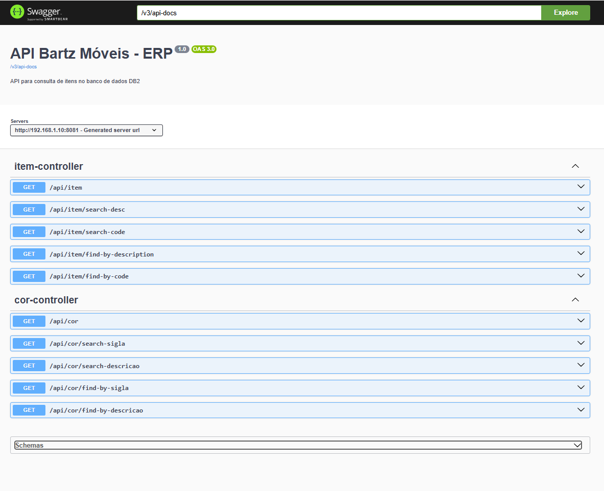
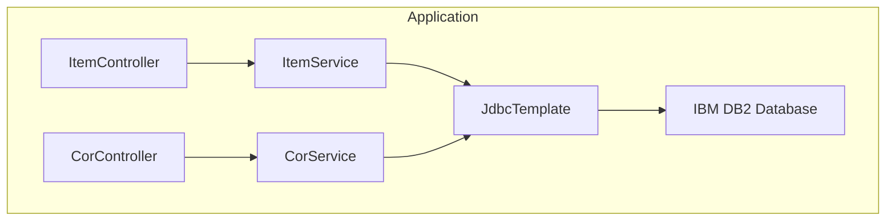

<div align="center">

# 🏗️ Bartz Móveis ERP API

### REST API de Integração (Ponte) para o ERP Legado (IBM DB2)

[](https://www.oracle.com/java/)
[](https://spring.io/projects/spring-boot)
[](https://www.ibm.com/products/db2)
[](https://www.docker.com/)
[](#-segurança)
[](https://swagger.io/)

</div>

---

## 📸 Preview (Swagger UI)

<div align="center">
  
</div>

---

## 📌 Sobre o Projeto

A **Bartz Móveis ERP API** atua como uma **Camada Anticorrupção (Ponte)** entre o frontend moderno e o sistema ERP legado (IBM DB2). 

Para garantir a máxima performance e simplicidade no acesso aos dados legados, a API utiliza **Spring JDBC (JdbcTemplate)** em vez de um ORM completo. Isso permite consultas SQL nativas otimizadas para o DB2, retornando dados diretamente em DTOs (Data Transfer Objects), eliminando o overhead de gerenciamento de entidades JPA em um cenário de leitura intensiva.

Construída com foco em **produção real**, a API incorpora:

- ✅ **Arquitetura Simplificada** (Controller → Service → JdbcTemplate)
- ✅ **Segurança Stateless** via JWT (Pacote Modular `jwt-package`)
- ✅ **Consultas Nativas** otimizadas para IBM DB2
- ✅ **Containerização completa** com Docker e Docker Compose
- ✅ **Documentação interativa** com Swagger / OpenAPI 3
- ✅ **Suíte de testes** abrangente (Controllers e Services)
- ✅ **Tratamento Global de Erros** padronizado

---

## 🏛️ Arquitetura

### Fluxo de Dados (Stateless)


```mermaid
flowchart TB
  subgraph Application
    A1["ItemController"] --> B1["ItemService"]
    A2["CorController"] --> B2["CorService"]
    B1 --> C1["JdbcTemplate"]
    B2 --> C1
    C1 --> D["IBM DB2 Database"]
  end
```

### Estrutura de Pastas

```
📦 apigetitem
 ├── 🔐 security/            # Filtros de segurança (JWT-Package)
 ├── ⚙️ config/              # Configurações de Segurança e Swagger
 ├── 📡 controller/          # Endpoints REST (ItemController, CorController)
 ├── 🧩 service/             # Regras de negócio e Consultas SQL (JdbcTemplate)
 ├── 📤 dto/                 # Data Transfer Objects (ItemDTO, CorDTO)
 └── ⚠️ exceptions/          # Tratamento global de erros (GlobalExceptionHandler)
```

---

## 🚀 Endpoints da API

### 📦 Itens (`/itens`)
| Método | Endpoint | Parâmetro | Descrição | Auth |
|--------|----------|-----------|-----------|------|
| `GET` | `/itens` | - | Lista todos os itens | ✅ |
| `GET` | `/itens/search` | `codigo` | Busca por código (parcial/exato) | ✅ |
| `GET` | `/itens/search` | `descricao` | Busca por descrição (parcial/exato) | ✅ |

### 🎨 Cores (`/cores`)
| Método | Endpoint | Parâmetro | Descrição | Auth |
|--------|----------|-----------|-----------|------|
| `GET` | `/cores` | - | Lista todas as cores | ✅ |
| `GET` | `/cores/search` | `codigo` | Busca por sigla/código | ✅ |
| `GET` | `/cores/search` | `descricao` | Busca por descrição | ✅ |

---

## 🔐 Segurança

A autenticação é baseada em **JWT (JSON Web Token)** de forma totalmente Stateless, utilizando o pacote modular `jwt-package`.

**Header Obrigatório:**
```http
Authorization: Bearer <seu_token_jwt>
```

**Fluxo Interno:**
1. O `JwtAuthFilter` intercepta a requisição.
2. Valida o token usando a `jwt.secret-key` definida no `.env`.
3. Se válido, libera o acesso às consultas ao DB2.
4. Se inválido ou expirado, retorna `401 Unauthorized`.

---

## 🧪 Testes

A API possui cobertura de testes automatizados com JUnit 5 e Mockito:

| Camada | Ferramenta | Classes de Teste |
|--------|------------|-----------------|
| **Service (Unit)** | JUnit 5 + Mockito | `BartzErpServiceTest`, `CorServiceTest` |
| **Controller (Integration)** | `@WebMvcTest` + MockMvc | `BartzErpControllerTest`, `CorControllerTest` |

```bash
# Executar todos os testes
./mvnw test
```

---

## 🐳 Rodando com Docker (Produção)

**1. Configure o arquivo `.env`:**
```env
jwt.secret-key=sua_chave_secreta_com_no_minimo_32_chars
jwt.excluded-paths=/auth/login, /swagger-ui/**, /v3/api-docs/**
jwt.expiration-time=43200000
DB_URL=jdbc:db2://seu_host:50000/nomedobanco
DB_USERNAME=usuario_db2
DB_PASSWORD=senha_db2
DB_PORT=8080
```

**2. Suba o container:**
```bash
docker-compose up --build -d
```

---

## 📖 Documentação Interativa (Swagger)

Acesse: `http://localhost:{PORTA}/swagger-ui.html`

A documentação permite testar todos os endpoints. Lembre-se de configurar o **Authorize** com o token JWT (Bearer) para chamadas protegidas.

---

## 📊 Estrutura de Dados (DB2)

A API mapeia as seguintes informações do banco legado:

- **Tabela `ITEM`**: Campos `ITEM` (Código), `DESCRICAO` e `REF_COMERCIAL`.
- **Tabela `COR`**: Campos `SIGLA_COR` e `DESCRICAO`.

---

## 🛠️ Stack Tecnológica

| Tecnologia | Versão | Finalidade |
|-----------|--------|------------|
| Java | 17 (LTS) | Linguagem principal |
| Spring Boot | 3.4.2 | Framework web e IoC |
| Spring JDBC | — | Acesso a dados via JdbcTemplate |
| Spring Security | 6.4.x | Controle de acesso via JWT |
| JWT Package | 1.0.3 | Pacote customizado para gestão de tokens |
| IBM DB2 | 12.1 | Banco de dados legado |
| SpringDoc OpenAPI | 2.0 | Documentação Swagger |
| Lombok | — | Redução de boilerplate |
| Docker + Compose | — | Containerização |
| JUnit 5 + Mockito | — | Testes automatizados |
| Maven | 3.9+ | Gerenciamento de build |

---

## 👨‍💻 Autor

Desenvolvido por **Roberto Lara** — Backend Developer

[](https://github.com/betolara1)

---

<div align="center">

**Bartz Móveis ERP API** — A ponte segura e performática para seus dados legados.

</div>

