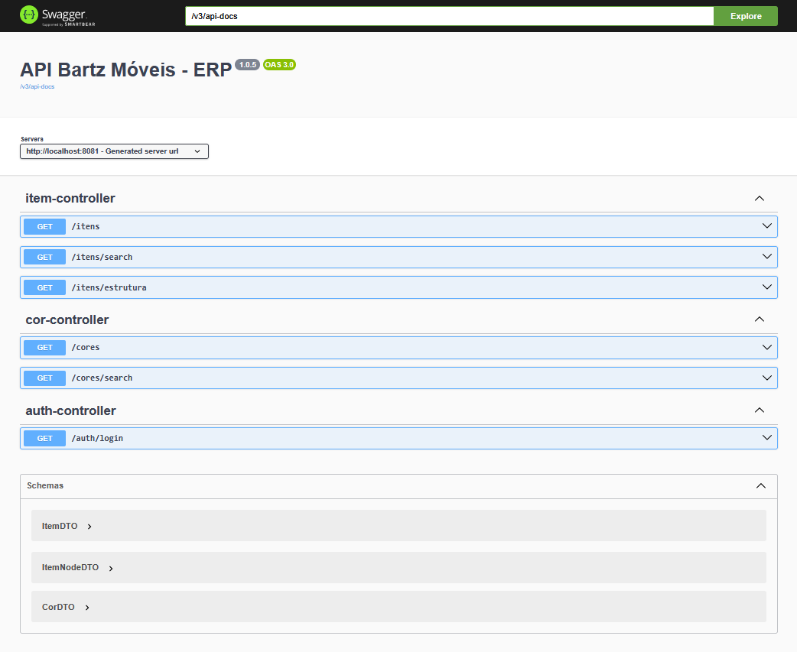
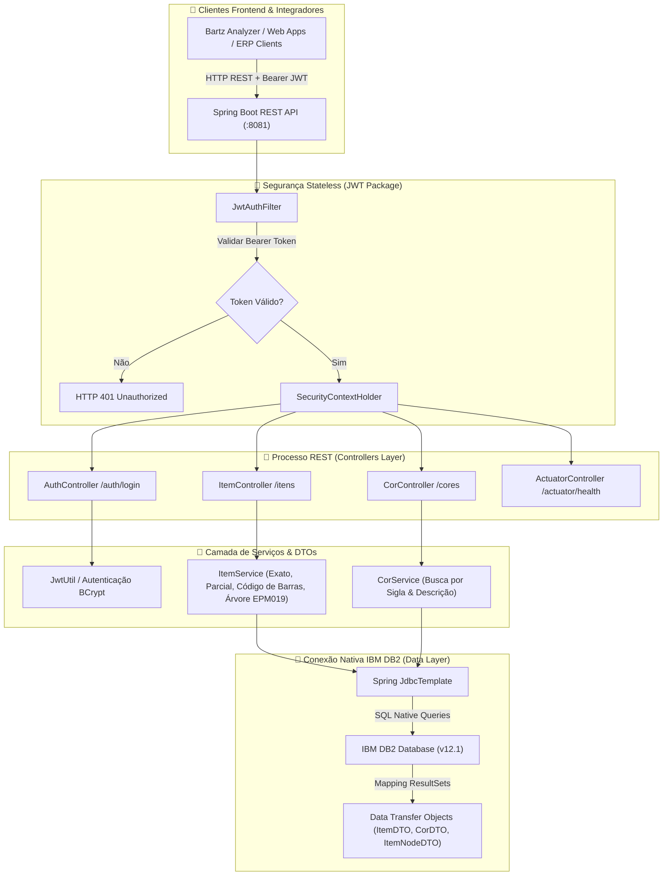

<div align="center">

# 🏗️ Bartz Móveis ERP API

### REST API de Integração (Ponte) para o ERP Legado (IBM DB2)

[](https://www.oracle.com/java/)
[](https://spring.io/projects/spring-boot)
[](https://www.ibm.com/products/db2)
[](https://www.docker.com/)
[](#-modelo-de-segurança--autenticação-jwt)
[](https://swagger.io/)
[](https://junit.org/junit5/)

---

*Uma camada anticorrupção (ACL) de alta performance desenvolvida para conectar soluções modernas ao ERP legado IBM DB2, garantindo consultas de catálogo, estrutura de itens EPM019 e autenticação segura via REST API.*

</div>

---

## 📸 Preview (Swagger UI)

<div align="center">
  
</div>

---

## 📌 Resumo Executivo & Contexto de Negócio

No ecossistema fabril e tecnológico da **Bartz Móveis Planejados**, aplicações modernas (como o **Bartz Analyzer**, portais web de pedidos e sistemas de validação de engenharia) necessitam consultar em tempo real informações críticas do catálogo de produtos, especificações de materiais, siglas de cores e composições de montagem de itens.

O sistema de gestão central da fábrica opera sobre um banco de dados **IBM DB2** legado. O uso direto de ferramentas de ORM tradicionais (como JPA/Hibernate) para leitura de estruturas relacionais complexas de grande porte em produção trazia *overhead* desnecessário de gerenciamento de entidades, gargalos de memória e consultas de baixa performance.

A **Bartz Móveis ERP API** foi desenvolvida como uma **Camada Anticorrupção (Anti-Corruption Layer - ACL) de Missão Crítica**. Ela atua como um microsserviço intermediário de alta performance que utiliza **Spring JDBC (`JdbcTemplate`)** para executar consultas SQL nativas diretamente otimizadas para a engine do IBM DB2. 

A API expõe dados limpos, sanitizados e fortemente tipados em **DTOs (Data Transfer Objects)** via JSON, protegidos por autenticação **JWT Stateless**, garantindo sub-milissegundos de tempo de resposta para os sistemas de chão de fábrica.

---

## ⚙️ Arquitetura de Software & Design Patterns

A aplicação foi projetada seguindo padrões modernos de arquitetura backend, visando **desempenho extremo, isolamento de responsabilidades e segurança stateless**.


```mermaid
graph TD
    subgraph ClientLayer ["📱 Clientes Frontend & Integradores"]
        A["Bartz Analyzer / Web Apps / ERP Clients"] -->|HTTP REST + Bearer JWT| B["Spring Boot REST API (:8081)"]
    end

    subgraph SecurityLayer ["🔐 Segurança Stateless (JWT Package)"]
        B --> C["JwtAuthFilter"]
        C -->|Validar Bearer Token| D{"Token Válido?"}
        D -->|Não| E["HTTP 401 Unauthorized"]
        D -->|Sim| F["SecurityContextHolder"]
    end

    subgraph ControllerLayer ["📡 Processo REST (Controllers Layer)"]
        F --> G["AuthController /auth/login"]
        F --> H["ItemController /itens"]
        F --> I["CorController /cores"]
        F --> J["ActuatorController /actuator/health"]
    end

    subgraph ServiceLayer ["🧩 Camada de Serviços & DTOs"]
        G --> K["JwtUtil / Autenticação BCrypt"]
        H --> L["ItemService (Exato, Parcial, Código de Barras, Árvore EPM019)"]
        I --> M["CorService (Busca por Sigla & Descrição)"]
    end

    subgraph DataLayer ["💾 Conexão Nativa IBM DB2 (Data Layer)"]
        L --> N["Spring JdbcTemplate"]
        M --> N
        N -->|SQL Native Queries| O["IBM DB2 Database (v12.1)"]
        O -->|Mapping ResultSets| P["Data Transfer Objects (ItemDTO, CorDTO, ItemNodeDTO)"]
    end
```

### 🏢 Decisões Arquiteturais de Destaque

* **Camada Anticorrupção (ACL Pattern):** Isola os sistemas consumidores da complexidade e peculiaridades de nomenclatura do banco de dados relacional legado DB2.
* **Spring JDBC (`JdbcTemplate`):** Em substituição ao Hibernate/JPA, permitindo mapeamento direto de `ResultSet` para DTOs imutáveis, eliminando problemas de *N+1 queries*, *dirty checking* e *lazy loading overhead*.
* **Arquitetura Simplificada & Limpa:** Organizada estritamente no fluxo `Controller → Service → JdbcTemplate`, promovendo legibilidade, testabilidade unitária e baixíssima manutenção.
* **Mapeamento de Estrutura Hierárquica (`EPM019`):** Algoritmo de montagem recursiva para transformação de registros planos de componentes (`ITEM_PAI` e `ITEM_FILHO`) em árvores de produtos (`ItemNodeDTO`).

---

## ⚡ Endpoints da API em Detalhes

### 🔑 Autenticação (`/auth`)

| Método | Endpoint | Parâmetros Query | Descrição | Auth | Resposta (DTO) |
| :--- | :--- | :--- | :--- | :---: | :--- |
| `GET` | `/auth/login` | `username`, `password` | Autentica usuário administrativo e gera token JWT | ❌ | `String` (Token JWT) |

---

### 📦 Catálogo de Itens & Estruturas (`/itens`)

| Método | Endpoint | Parâmetros Query | Descrição | Auth | Resposta (DTO) |
| :--- | :--- | :--- | :--- | :---: | :--- |
| `GET` | `/itens` | - | Lista todos os itens cadastrados no ERP | ✅ | `List<ItemDTO>` |
| `GET` | `/itens/search` | `codigo` | Busca exata ou parcial de item por código | ✅ | `List<ItemDTO>` |
| `GET` | `/itens/search` | `descricao` | Busca exata ou parcial por descrição de produto | ✅ | `List<ItemDTO>` |
| `GET` | `/itens/search` | `codigoBarras` | Busca direta de item pelo Código de Barras EAN | ✅ | `List<ItemDTO>` |
| `GET` | `/itens/estrutura` | `codigo` | Retorna a estrutura hierárquica em árvore do item (EPM019) | ✅ | `ItemNodeDTO` |

---

### 🎨 Tabela de Cores & Fitas (`/cores`)

| Método | Endpoint | Parâmetros Query | Descrição | Auth | Resposta (DTO) |
| :--- | :--- | :--- | :--- | :---: | :--- |
| `GET` | `/cores` | - | Lista todas as cores e acabamentos do ERP | ✅ | `List<CorDTO>` |
| `GET` | `/cores/search` | `codigo` | Busca de cor por sigla/código de referência | ✅ | `List<CorDTO>` |
| `GET` | `/cores/search` | `descricao` | Busca de cor por descrição técnica | ✅ | `List<CorDTO>` |

---

### 🏥 Monitoramento & Diagnóstico (`/actuator`)

| Método | Endpoint | Parâmetro | Descrição | Auth | Resposta |
| :--- | :--- | :--- | :--- | :---: | :--- |
| `GET` | `/actuator/health` | - | Checagem de integridade e status de saúde da API | ❌ | `{"status": "UP"}` |

---

## 🔐 Modelo de Segurança & Autenticação JWT

A segurança da API é gerida pelo módulo customizado `jwt-package`, operando de forma totalmente **Stateless**.

```
[ Cliente HTTP ] --(1) GET /auth/login?username=X&password=Y --> [ AuthController ]
                                                                       |
[ Cliente HTTP ] <--(2) Retorna Token JWT (String Base64) -------------+
       |
       +--(3) GET /itens/estrutura (Header: Authorization: Bearer <Token>) --> [ JwtAuthFilter ]
                                                                                      |
[ Resposta JSON ] <--(4) Retorna Dados do DB2 se Token for Válido ---------------------+
```

### Como Utilizar:

1. **Obtenção do Token:** Envie requisição `GET` para `/auth/login` com as credenciais configuradas no arquivo `.env`.
2. **Cabeçalho de Requisição:** Em todas as chamadas subsequentes aos endpoints protegidos, envie o token no header HTTP:
   ```http
   Authorization: Bearer <seu_token_jwt>
   ```
3. **Validação Autônoma:** O filtro `JwtAuthFilter` intercepta a requisição, valida a assinatura HMAC utilizando a `jwt.secret-key` e concede o acesso sem necessidade de consultas ao banco para checagem de sessão.

---

## 📊 Mapeamento de Entidades Legadas (IBM DB2)

A API abstrai a complexidade do banco relacional **IBM DB2 v12.1**, mapeando as tabelas legadas do sistema ERP:

| Tabela DB2 | Descrição da Entidade | Mapeamento no DTO |
| :--- | :--- | :--- |
| **`ITEM`** | Cadastro principal de produtos, peças e matérias-primas | `ItemDTO` (`codigo`, `descricao`, `refComercial`) |
| **`COR`** | Cadastro de siglas, fitas de borda e padrões de acabamento | `CorDTO` (`siglaCor`, `descricao`) |
| **`FICHABAS` / `EPM019`** | Tabela de composição estrutural e engenharia de produto | `ItemNodeDTO` (`codigo`, `descricao`, `filhos[]`) |

---

## 🏛️ Estrutura do Código Fonte

```
📦 BartzMoveisERP (apigetitem)
 ├── 📜 pom.xml                      # Dependências Maven (Spring Boot 3.4.2, DB2 Driver, JWT)
 ├── 🐳 Dockerfile                   # Build multi-stage para containerização Docker
 ├── 🐳 docker-compose.yml           # Subida simplificada da aplicação e variáveis de ambiente
 ├── 📂 src/main/java/bartzmoveis/apigetitem/
 │    ├── 🚀 ApigetitemApplication.java # Entry-point da aplicação Spring Boot
 │    ├── ⚙️ config/                 # Configurações de Segurança, CORS e Swagger OpenAPI 3
 │    │    ├── 🌐 CorsConfig.java    # Mapeamento de permissões CORS para requisições cross-origin
 │    │    ├── 🔐 SecurityConfig.java# Configuração Spring Security & Filtro JWT Interceptor
 │    │    └── 📖 SwaggerConfig.java # Customização de metadados do Swagger UI e esquemas JWT
 │    ├── 📡 controller/             # Endpoints REST (Auth, Item, Cor)
 │    │    ├── 🔑 AuthController.java # Autenticação administrativa e emissão de tokens JWT
 │    │    ├── 🎨 CorController.java  # Consultas de tabela de cores e siglas de chapas/fitas
 │    │    └── 📦 ItemController.java # Consultas de itens, código de barras e estrutura EPM019
 │    ├── 🧩 service/                # Camada de Regras de Negócio e SQL Nativo (JdbcTemplate)
 │    │    ├── 🎨 CorService.java     # Consultas SQL nativas DB2 para catálogo de cores
 │    │    └── 📦 ItemService.java    # Consultas SQL e construção da árvore hierárquica EPM019
 │    └── 📤 dto/                    # Data Transfer Objects (Respostas Imutáveis)
 │         ├── 🎨 CorDTO.java         # Mapeamento de Sigla e Descrição de Cor
 │         ├── 📦 ItemDTO.java        # Mapeamento de Código, Descrição e Referência Comercial
 │         ├── 🌳 ItemNodeDTO.java    # Estrutura em árvore de itens pai e filho (EPM019)
 │         └── 🔐 LoginDTO.java       # DTO para recebimento de credenciais de login
 └── 📂 src/test/java/bartzmoveis/apigetitem/ # Suíte de testes automatizados (JUnit 5 + Mockito)
      ├── 📡 controller/             # Testes de integração de endpoints REST (@WebMvcTest)
      └── 🧩 service/                # Testes unitários da camada de serviço e JdbcTemplate
```

---

## 💻 Instalação & Desenvolvimento

### Pré-requisitos

* **Java JDK** `21` (LTS) ou superior
* **Maven** `3.9` ou superior (ou utilizar o Maven Wrapper `./mvnw` incluso)
* Acesso à rede/instância do banco de dados **IBM DB2**

### Passos para Execução Local

```bash
# 1. Clonar o repositório
git clone https://github.com/betolara1/API-Bartz-Moveis-ERP.git
cd API-Bartz-Moveis-ERP

# 2. Configurar o arquivo .env ou variáveis de ambiente com as credenciais do DB2
# (Veja a seção "Rodando com Docker" para o modelo de arquivo .env)

# 3. Baixar dependências e executar a aplicação via Maven Wrapper
./mvnw spring-boot:run
```

---

## 📦 Como Gerar o Executável (.jar)

Para compilar o projeto e empacotar o executável Java otimizado para produção:

```bash
# Compilar e gerar o arquivo JAR na pasta /target
./mvnw clean package -DskipTests
```

O artefato gerado estará disponível em `target/apigetitem-0.0.1-SNAPSHOT.jar`.

---

## 🧪 Suíte de Testes & Qualidade de Código

A qualidade das rotas REST e das consultas de serviço é garantida por testes unitários e de integração utilizando **JUnit 5** e **Mockito**.

```bash
# Executar toda a suíte de testes automatizados
./mvnw test
```

### Escopo dos Testes:
* **`CorServiceTest` & `BartzErpServiceTest`:** Validação unitária do comportamento dos serviços e mapeamentos `JdbcTemplate`.
* **`CorControllerTest` & `BartzErpControllerTest`:** Testes de integração das rotas HTTP com `@WebMvcTest` e chamadas mockadas via `MockMvc`.

---

## 🐳 Execução em Produção via Docker

A aplicação conta com arquivo `Dockerfile` otimizado em múltiplos estágios (*multi-stage build*) e `docker-compose.yml` para implantação em containers.

### 1. Criar o Arquivo `.env` na Raiz do Projeto:

```env
# Segurança JWT
jwt.secret-key=sua_chave_secreta_com_no_minimo_32_chars
jwt.excluded-paths=/auth/login, /swagger-ui/**, /v3/api-docs/**
jwt.expiration-time=43200000

# Conexão IBM DB2
URL_DB=jdbc:db2://seu_host_db2:50000/nomedobanco
USERNAME_DB=usuario_db2
PASSWORD_DB=senha_db2

# Credenciais da API (Admin)
USERNAME_LOGIN=admin
PASSWORD_LOGIN=sua_senha_criptografada_bcrypt

# Porta da Aplicação
DB_PORT=8081
```

### 2. Inicializar os Containers:

```bash
# Subir a aplicação containerizada em segundo plano
docker-compose up --build -d
```

---

## 📖 Documentação Interativa (Swagger / OpenAPI 3)

Com a aplicação em execução, acesse no navegador:

```text
http://localhost:8081/swagger-ui.html
```

A interface do **Swagger UI** permite testar interativamente todas as requisições. Lembre-se de autenticar no botão **Authorize** informando o cabeçalho `Bearer <seu_token_jwt>` gerado pelo endpoint `/auth/login`.

---

## 🛠️ Stack Tecnológica

| Categoria | Tecnologia | Versão | Aplicação |
| :--- | :--- | :--- | :--- |
| **Linguagem** | **Java** | `21 (LTS)` | Linguagem principal de desenvolvimento |
| **Framework Core** | **Spring Boot** | `3.4.2` | Framework base para microsserviço backend |
| **Acesso a Dados** | **Spring JDBC** | `3.4.2` | Consultas nativas otimizadas via `JdbcTemplate` |
| **Segurança** | **Spring Security** | `6.4.x` | Controle de acesso HTTP e filtros de segurança |
| **Autenticação** | **JWT Package** | `1.0.4` | Gestão e validação modular de tokens JWT |
| **Banco de Dados** | **IBM DB2** | `12.1` | Banco de dados relacional legado corporativo |
| **Documentação** | **SpringDoc OpenAPI** | `2.3.0` | Geração automática da documentação Swagger UI |
| **Diagnóstico** | **Spring Boot Actuator** | `3.4.2` | Endpoints de saúde e telemetria (`/actuator/health`) |
| **Testes Unitários** | **JUnit 5 / Mockito** | `5.x` | Suíte de testes automatizados de unidade e integração |
| **Containerização** | **Docker / Compose** | `Latest` | Empacotamento em container e orquestração de produção |
| **Build Tool** | **Maven** | `3.9+` | Gerenciador de dependências e automação de build |

---

## 👨‍💻 Autor & Engenharia de Desenvolvimento

Desenvolvido por **Roberto Lara** — *Backend Developer*

[](https://github.com/betolara1)

---

<div align="center">

**Bartz Móveis ERP API** — *A Ponte Segura e Performática para Integração de Dados Legados.*

> **Nota:** Este projeto utiliza o agente de inteligência artificial **Antigravity** (Google DeepMind) para aceleração de desenvolvimento, arquitetura de microsserviços, documentação técnica e conformidade com boas práticas de engenharia de software.

</div>
